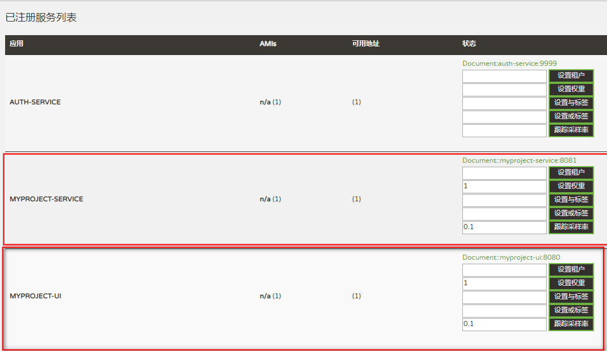

# 项目构建手册

> 作者 王立松

通过本文档可以快速部署一个认证服务、注册服务，并开发一个你的SERVICE、UI服务，你可以看到服务是如何注册到注册中心，并通过认证服务登录后完成一个UI到SERVICE调用的样例

## 1. 准备

* 已安装发现服务
* 已安装认证服务
* 开发环境 JDK1.8+
* 开发工具 Spring Tool Suite

## 2. 项目构建

* SERVICE创建

1. 打开Spring Tool Suite，创建Spring Starter Project

   
   
   
   
   
   
2. pom.xml更改

```xml
<?xml version="1.0" encoding="UTF-8"?>
<project xmlns="http://maven.apache.org/POM/4.0.0" xmlns:xsi="http://www.w3.org/2001/XMLSchema-instance"
	xsi:schemaLocation="http://maven.apache.org/POM/4.0.0 http://maven.apache.org/xsd/maven-4.0.0.xsd">
	<modelVersion>4.0.0</modelVersion>

	<groupId>org.iplatform</groupId>
	<artifactId>demo-service</artifactId>
	<version>0.0.1-SNAPSHOT</version>
	<packaging>jar</packaging>

	<name>demo-service</name>
	<description>demo-service</description>
	
	<parent>
		<groupId>org.iplatform</groupId>
		<artifactId>iplatform-parent</artifactId>
		<version>0.0.7-SNAPSHOT</version>
		<relativePath></relativePath>
	</parent>
	
	<dependencies>
		<dependency>
			<groupId>org.iplatform</groupId>
			<artifactId>iplatform-util</artifactId>
			<exclusions>
				<exclusion>
					<artifactId>slf4j-log4j12</artifactId>
					<groupId>org.slf4j</groupId>
				</exclusion>
			</exclusions>
		</dependency>
        <dependency>
            <groupId>org.iplatform</groupId>
            <artifactId>iplatform-service</artifactId>
        </dependency>       
	</dependencies>

	<build>
		<plugins>
			<plugin>
				<groupId>org.springframework.boot</groupId>
				<artifactId>spring-boot-maven-plugin</artifactId>
			</plugin>
			<plugin>
				<groupId>org.apache.maven.plugins</groupId>
				<artifactId>maven-surefire-plugin</artifactId>
				<configuration>
					<skipTests>true</skipTests>
				</configuration>
			</plugin>
		</plugins>
	</build>

	<repositories>
		<repository>
			<id>boco-nexus-public</id>
			<name>Team Nexus Repository</name>
			<url>http://111.204.35.232/nexus/content/groups/public</url>
		</repository>
	</repositories>
```


* UI创建

## 3. 添加依赖

## 4. 服务配置

## 5. 服务启动

## 6. 服务验证
